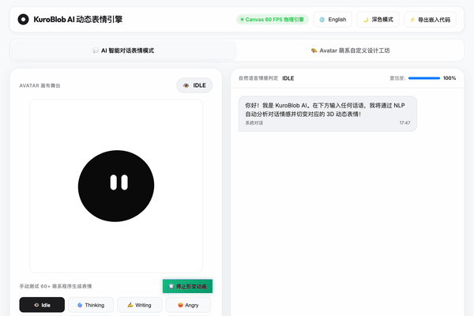

# 🖤 KuroBlob AI — 3D Liquid Mercury Procedural Avatar & Creator Studio

> **A high-performance 60 FPS HTML5 Canvas procedural liquid mercury avatar engine powered by 24-point Bezier spring physics, NLP sentiment classification, and a full-featured Avatar Creator Studio.**

<p align="center">
  
</p>

<p align="center">
  <a href="#english">English</a> | <a href="#简体中文">简体中文</a>
</p>

---

<a name="english"></a>
## 🌟 English Overview

**KuroBlob AI** (`黑呆萌`) is an interactive, web-native procedural avatar engine designed to bring dynamic 3D-like liquid mercury characters to life. Featuring a strict **Pure-Black (#0A0A0C) Brand Identity**, **24-Point Bezier Control Spring Physics Engine**, a **Weather Forecast Suite**, **NLP Dialogue Sentiment Classifier**, and an interactive **Avatar Creator Studio**.

### ✨ Key Features

- **🖤 Iconic Pure-Black Brand Identity**: 100% pure black `#0A0A0C` body silhouette across all 60+ emotions to preserve avatar character integrity, accented by vibrant, colorful accessories.
- **💧 24-Point Bezier Spring Physics Morphing**: 100% organic, continuous liquid mercury spring physics interpolation (`stiffness = 0.12`, `damping = 0.82`) between any two body silhouettes (Cloud, Tornado, UFO, Cat, Bunny, Panda, Triangle, Robot, etc.) without discrete frame snapping.
- **👁️ 3D Spherical Eye Position Deformer**: Freely adjust eye position on a 3D spherical coordinate system ($[-45\text{px}, +45\text{px}]$), combined tilt angle ($[-45^\circ, +45^\circ]$), slant angle, eye width, height, and spacing.
- **🌤️ Weather Forecast Suite**: Built-in 10 weather procedural states (`SUNNY`, `RAIN`, `THUNDER`, `SNOWY`, `WINDY`, `FOGGY`, `RAINBOW`, `HAIL`, `TORNADO`, `CLOUD`).
- **🎨 Avatar Creator Studio**: Customize 9 body silhouettes, 5 eye styles, 3D orbital rings, cosmic dust streams, pink blush, and 15+ head & aura accessories.
- **💾 LocalStorage Custom Pack Generator**: Save customized designs directly into the manual testing grid with custom names & emojis for instant cross-session recall.
- **🌐 Bilingual i18n**: Instant one-click English / Simplified Chinese switching.

---

## 🚀 Quick Start

### Prerequisites
No framework compilation required! Built with standard Vanilla JS & HTML5 Canvas.

### Running Locally
```bash
# Clone repository
git clone https://github.com/eykicuihb/KuroBlob-AI.git
cd KuroBlob-AI

# Start local HTTP server
python3 -m http.server 3000
# or
npx serve .
```

Open `http://localhost:3000` in your web browser.

---

## 🏗️ Architecture

```
avatar-dialogue-app/
├── index.html          # Application markup & Studio layout
├── style.css           # Premium Glassmorphism CSS design system
└── js/
    ├── app.js          # App controller & UI event binding
    ├── avatar-renderer.js # 24-point Bezier spring physics renderer
    ├── dialogue-engine.js # AI dialogue & NLP sentiment classifier
    └── i18n.js         # Bilingual i18n dictionary & switcher
```

---

<a name="简体中文"></a>
## 🌟 简体中文 简介

**KuroBlob AI (黑呆萌)** 是一款基于原生 HTML5 Canvas 开发的高保真程序化 3D 液态动态表情引擎与设计工坊。项目采用 **纯黑 (#0A0A0C) 角色 IP 标识**、**24 点贝塞尔弹簧物理流体形变引擎**、**天气预报萌系套件**、**自然语言情感判定** 以及 **高自由度 Avatar Creator Studio 设计工坊**。

### ✨ 核心亮点

- **🖤 纯黑品牌 IP 一致性**: 无论表情与形态如何变幻，角色主体严格保持 `#0A0A0C` 纯黑水银质感，搭配多彩外置配饰，展现独特极简萌系风格。
- **💧 24 点贝塞尔物理弹力连续形变**: 在云朵、龙卷风、UFO 飞碟、猫耳、兔耳、熊猫耳、机器人、思考三角等 60+ 表情形态间切换时，实现 100% 顺滑水银流体弹簧形变。
- **👁️ 3D 球面眼球位置自由摆放**: 支持在 3D 球面坐标系 ($[-45\text{px}, +45\text{px}]$) 上自由调整眼球经纬度位置、双眼整体平行倾斜角 ($[-45^\circ, +45^\circ]$) 以及对称斜角与宽高间距。
- **🌤️ 天气预报萌系套件**: 包含晴天、雨天、雷暴、雪花、大风、大雾、绚丽彩虹、冰雹、龙卷风、云朵等 10 大萌系天气程序化渲染。
- **🎨 Avatar Creator Studio 设计工坊**: 自由定制 9 大主体廓形、5 种眼神预设、3D 轨道彩虹环、宇宙星尘流光、粉嫩腮红与 15+ 头部/环境配饰。
- **💾 一键保存至表情包**: 支持将自定义设计的表情保存至 LocalStorage，自动生成专属紫色网格按钮，随时一键复用。
- **🌐 中英文双语支持**: 支持界面一键无缝中英文切换。

---

## 📄 License

MIT License © 2026 KuroBlob AI Team
